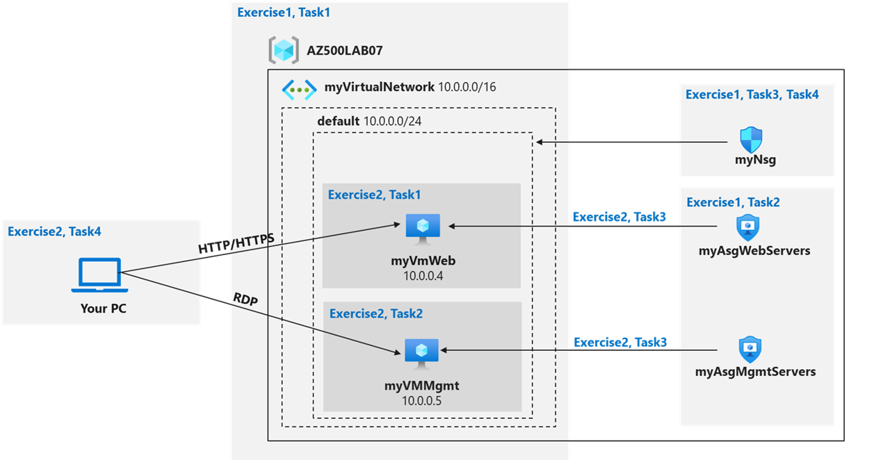

---
lab:
  title: 02 – Einrichten von Netzwerk- und Anwendungssicherheitsgruppen
  module: Module 01 - Plan and implement security for virtual networks
---

# Lab 02: Netzwerksicherheitsgruppen und Anwendungssicherheitsgruppen
# Lab-Handbuch für Kursteilnehmer

## Labszenario

Sie wurden aufgefordert, die virtuelle Netzwerkinfrastruktur Ihrer Organisation zu implementieren und zu testen, um sicherzustellen, dass sie ordnungsgemäß funktioniert. Dies gilt insbesondere für:

- Die Organisation verfügt über zwei Gruppen von Servern: Webserver und Verwaltungsserver.
- Jede Gruppe von Servern sollte sich in einer eigenen Anwendungssicherheitsgruppe befinden. 
- Sie sollten in der Lage sein, RDP auf die Verwaltungsserver, aber nicht auf die Webserver zu übertragen.
- Auf den Webservern sollte die IIS-Webseite angezeigt werden, wenn über das Internet darauf zugegriffen wird. 
- Regeln für Netzwerksicherheitsgruppen sollten verwendet werden, um den Netzwerkzugriff zu steuern. 

> Für alle Ressourcen in diesem Lab verwenden wir die Region **USA, Osten**. Vergewissern Sie sich bei Ihrem Kursleiter, dass dies die Region ist, die für den Kurs verwendet werden soll. 

## Ziele des Labs

In diesem Lab führen Sie die folgenden Übungen aus:

- Übung 1: Erstellen der virtuellen Netzwerkinfrastruktur
- Übung 2: Bereitstellen virtueller Computer und Testen der Netzwerkfilter

## Diagramm zu Netzwerk- und Anwendungssicherheitsgruppen



## Anweisungen

### Übung 1: Erstellen der virtuellen Netzwerkinfrastruktur

### Geschätzte Zeit: 20 Minuten

> Für alle Ressourcen in diesem Lab verwenden wir die Region **USA, Osten**. Vergewissern Sie sich bei Ihrem Kursleiter, dass dies die Region ist, die für den Kurs verwendet werden soll. 

In dieser Übung führen Sie die folgenden Aufgaben aus:

- Aufgabe 1: Erstellen eines virtuellen Netzwerks mit einem Subnetz.
- Aufgabe 2: Erstellen von zwei Anwendungssicherheitsgruppen.
- Aufgabe 3: Erstellen einer Netzwerksicherheitsgruppe und Zuordnen der NSG zum virtuellen Netzwerksubnetz.
- Aufgabe 4: Erstellen von NSG-Sicherheitsregeln für den gesamten eingehenden Datenverkehr an Webserver und RDP an die Verwaltungsserver.

#### Aufgabe 1: Erstellen eines virtuellen Netzwerks

In dieser Aufgabe erstellen Sie ein virtuelles Netzwerk für die Verwendung mit den Netzwerk- und Anwendungssicherheitsgruppen. 

1. Melden Sie sich beim Azure-Portal ( **`https://portal.azure.com/`** ) an.

    >**Hinweis**: Melden Sie sich beim Azure-Portal mit einem Konto an, dem in dem Azure-Abonnement, das Sie für dieses Lab verwenden, die Rolle „Besitzer“ oder „Mitwirkender“ zugewiesen ist.

2. Geben Sie im Azure-Portal oben auf der Seite für das Azure-Portal im Textfeld **Nach Ressourcen, Diensten und Dokumenten suchen** +++Virtuelle Netzwerke+++ ein, und drücken Sie die **EINGABETASTE**.

3. Klicken Sie auf dem Blatt **Virtuelle Netzwerke** auf **+ Erstellen**.

4. Geben Sie auf dem Blatt **Virtuelles Netzwerk erstellen** auf der Registerkarte **Grundeinstellungen** die folgenden Einstellungen an (übernehmen Sie die Standardwerte für andere Einstellungen), und klicken Sie auf **Weiter: IP-Adressen**:

    |Einstellung|Wert|
    |---|---|
    |Subscription | Name des Azure-Abonnements, das Sie in diesem Lab verwenden |
    |Ressourcengruppe | Verwenden Sie die angegebene Ressourcengruppe mit dem Namen **AZ500LAB07**. |
    |Name| +++myVirtualNetwork+++ |
    |Region| **USA, Osten** |

5. Legen Sie auf dem Blatt **Virtuelles Netzwerk erstellen** auf der Registerkarte **IP-Adressen** den **IPv4-Adressraum** auf **10.0.0.0/16** fest. Klicken Sie, falls erforderlich, in der Spalte **Subnetzname** auf **Standard**, geben Sie auf dem Blatt **Subnetz bearbeiten** die folgenden Einstellungen an, und klicken Sie dann auf **Speichern**:

    |Einstellung|Wert|
    |---|---|
    |Subnetzname|**default**|
    |Subnetzadressbereich|**10.0.0.0/24**|

6. Klicken Sie wieder auf der Registerkarte **IP-Adressen** des Bildschirms **Virtuelles Netzwerk erstellen** auf **Überprüfen + erstellen**.

7. Klicken Sie auf der Registerkarte **Überprüfen + erstellen** des Bildschirms **Virtuelles Netzwerk erstellen** auf **Erstellen**.

#### Aufgabe 2: Erstellen von Anwendungssicherheitsgruppen

In dieser Aufgabe erstellen Sie eine Anwendungssicherheitsgruppe.

1. Geben Sie im Azure-Portal oben auf der Seite für das Azure-Portal im Textfeld **Nach Ressourcen, Diensten und Dokumenten durchsuchen** +++Anwendungssicherheitsgruppen+++ ein, und drücken Sie die **EINGABETASTE**.

2. Klicken Sie auf dem Blatt **Anwendungssicherheitsgruppen** auf **+ Erstellen**.

3. Geben Sie die folgenden Einstellungen auf der Registerkarte **Grundlagen** des Blatts **Anwendungssicherheitsgruppe erstellen** an: 

    |Einstellung|Wert|
    |---|---|
    | Resource group | **AZ500LAB07** |
    | Name | +++myAsgWebServers+++ |
    | Region | **USA, Osten** |

    >**Hinweis:** Diese Gruppe ist für die Webserver vorgesehen.

4. Klicken Sie auf **Überprüfen + erstellen** und dann auf **Erstellen**.

5. Navigieren Sie zurück zum Blatt **Anwendungssicherheitsgruppen** und klicken Sie auf **+ Erstellen**.

6. Geben Sie die folgenden Einstellungen auf der Registerkarte **Grundlagen** des Blatts **Anwendungssicherheitsgruppe erstellen** an: 

    |Einstellung|Wert|
    |---|---|
    |Resource group|**AZ500LAB07**|
    |Name| +++myAsgMgmtServers+++ |
    |Region|**USA, Osten**|

    >**Hinweis:** Diese Gruppe ist für die Verwaltungsserver vorgesehen.

7. Klicken Sie auf **Überprüfen + erstellen** und dann auf **Erstellen**.

#### Aufgabe 3: Erstellen einer Netzwerksicherheitsgruppe und Zuordnen der NSG zum Subnetz

In dieser Aufgabe erstellen Sie eine Netzwerksicherheitsgruppe. 

1. Geben Sie im Azure-Portal oben auf der Seite für das Azure-Portal im Textfeld **Nach Ressourcen, Diensten und Dokumenten suchen** +++Netzwerksicherheitsgruppen+++ ein, und drücken Sie die **EINGABETASTE**.

2. Klicken Sie auf dem Blatt **Netzwerksicherheitsgruppen** auf **+ Erstellen**.

3. Geben Sie auf dem Blatt **Netzwerksicherheitsgruppe erstellen** auf der Registerkarte **Grundeinstellungen** die folgenden Einstellungen an: 

    |Einstellung|Wert|
    |---|---|
    | Subscription | Name des Azure-Abonnements, das Sie in diesem Lab verwenden |
    | Ressourcengruppe | **AZ500LAB07** |
    | Name | +++myNsg+++ |
    | Region | **USA, Osten** |

4. Klicken Sie auf **Überprüfen + erstellen** und dann auf **Erstellen**.

5. Navigieren Sie im Azure-Portal wieder zum Blatt **Netzwerksicherheitsgruppen**, und wählen Sie den Eintrag **myNsg** aus. Wählen Sie alternativ die Option **Zu Ressource wechseln**, sofern diese verfügbar ist.

6. Klicken Sie auf dem Blatt **myNsg** im Abschnitt **Einstellungen** auf **Subnetze**, und wählen Sie dann **+ Zuordnen** aus. 

7. Geben Sie auf dem Blatt **Subnetz zuordnen** die folgenden Einstellungen an, und wählen Sie **OK** aus:

    |Einstellung|Wert|
    |---|---|
    |Virtuelles Netzwerk|**myVirtualNetwork**|
    |Subnet|**default**|

#### Aufgabe 4: Erstellen von NSG-Sicherheitsregeln für den gesamten eingehenden Datenverkehr an Webserver und RDP an die Server. 

1. Klicken Sie auf dem Blatt **myNsg** im Abschnitt **Einstellungen** auf **Sicherheitsregeln für eingehenden Datenverkehr**.

2. Überprüfen Sie die Standardsicherheitsregeln für eingehenden Datenverkehr aus, und klicken Sie auf **+ Hinzufügen**.

3. Geben Sie auf dem Blatt **Sicherheitsregel für eingehenden Datenverkehr hinzufügen** die folgenden Einstellungen an, um TCP-Ports 80 und 443 für die Anwendungssicherheitsgruppe **myAsgWebServers** zuzulassen (übernehmen Sie für alle anderen Werte die Standardwerte): 

    |Einstellung|Wert|
    |---|---|
    | Quelle | **Alle** |
    | Quellportbereiche | * |
    |Destination|Wählen Sie in der Dropdownliste **Anwendungssicherheitsgruppe** aus, und klicken Sie dann auf **myAsgWebServers**.|
    | Dienst | **Benutzerdefiniert** |
    |Zielportbereiche|**80, 443**|
    |Protokoll|**TCP**|
    | Aktion | **Zulassen** |
    |Priorität|**100**|
    |Name|**Allow-Web-All**|

4. Wählen Sie auf der Seite **Eingangssicherheitsregel hinzufügen** die Schaltfläche **Hinzufügen** aus, um die neue Eingangsregel zu erstellen.

5. Klicken Sie auf dem Blatt **myNsg** im Abschnitt **Einstellungen** auf **Sicherheitsregeln für eingehenden Datenverkehr**, und klicken Sie dann auf **+ Hinzufügen**.

6. Geben Sie auf dem Blatt **Sicherheitsregel für eingehenden Datenverkehr hinzufügen** die folgenden Einstellungen an, um den RDP-Port (TCP 3389) für die Anwendungssicherheitsgruppe **myAsgMgmtServers** zuzulassen (übernehmen Sie für alle anderen Werte die Standardwerte): 

    |Einstellung|Wert|
    |---|---|
    | Quelle | **Alle** |
    | Quellportbereiche | * |
    |Destination|Wählen Sie in der Dropdownliste **Anwendungssicherheitsgruppe** aus, und klicken Sie dann auf **myAsgMgmtServers**.|
    | Dienst | **Benutzerdefiniert** |
    |Zielportbereiche|**3389**|
    |Protokoll|**TCP**|
    | Aktion | **Zulassen** |
    |Priorität|**110**|
    |Name|**Allow-RDP-All**|

7. Wählen Sie auf der Seite **Eingangssicherheitsregel hinzufügen** die Option **Hinzufügen** aus, um die neue Eingangsregel zu erstellen. 

> Ergebnis: Sie haben ein virtuelles Netzwerk, Netzwerksicherheit mit Sicherheitsregeln für eingehenden Datenverkehr und zwei Anwendungssicherheitsgruppen bereitgestellt. 

### Übung 2: Bereitstellen virtueller Computer und Testen der Netzwerkfilter

### Geschätzte Zeit: 25 Minuten

In dieser Übung führen Sie die folgenden Aufgaben aus:

- Aufgabe 1: Erstellen eines virtuellen Computers, der als Webserver verwendet werden soll.
- Aufgabe 2: Erstellen eines virtuellen Computers, der als Verwaltungsserver verwendet werden soll.
- Aufgabe 3: Zuordnen der einzelnen Netzwerkschnittstellen virtueller Computer zur entsprechenden Anwendungssicherheitsgruppe.
- Aufgabe 4: Testen der Filterung des Netzwerkdatenverkehrs.

#### Aufgabe 1: Erstellen eines virtuellen Computers zur Verwendung als Webserver

In dieser Aufgabe erstellen Sie einen virtuellen Computer, der als Webserver verwendet werden soll.

1. Geben Sie im Azure-Portal oben auf der Seite für das Azure-Portal im Textfeld **Nach Ressourcen, Diensten und Dokumenten suchen** +++Virtuelle Computer+++ ein, und drücken Sie die **EINGABETASTE**.

2. Klicken Sie auf dem Blatt **Virtuelle Computer** auf **+ Erstellen**, und klicken Sie in der Dropdownliste auf **+ Virtueller Azure-Computer**.

3. Geben Sie auf dem Blatt **Virtuellen Computer erstellen** auf der Registerkarte **Grundeinstellungen** die folgenden Einstellungen an (übernehmen Sie die Standardwerte für andere Einstellungen):

   |Einstellung|Wert|
   |---|---|
   |Subscription|Der Name des Azure-Abonnements, das Sie in diesem Lab verwenden.|
   |Resource group|**AZ500LAB07**|
   |Name des virtuellen Computers|**myVmWeb**|
   |Region|**(USA) USA, Osten**|
   |Verfügbarkeitsoptionen|**Keine Infrastrukturredundanz erforderlich**
   |Sicherheitstyp|**Standard**
   |Abbildung|**Windows Server 2022 Datacenter: Azure Edition – x64 Gen2**|
   |Size|**Standard D2s v3**|
   |Username|**Kursteilnehmer**|
   |Kennwort|**Erstellen Sie Ihr eigenes Kennwort, und notieren Sie es für spätere Zwecke in den nachfolgenden Übungen**|
   |Kennwort bestätigen|**Geben Sie Ihr Kennwort erneut ein.**|
   |Öffentliche Eingangsports|**None**|
   |Möchten Sie eine vorhandene Windows Server-Lizenz verwenden? |**Nein**|

    >**Hinweis**: Für öffentliche eingehende Ports verwenden wir die vorab erstellte Netzwerksicherheitsgruppe. 

5. Klicken Sie auf **Weiter: Datenträger >** , und legen Sie auf dem Blatt **Virtuellen Computer erstellen** auf der Registerkarte **Datenträger** den **Typ des Betriebssystemdatenträgers** auf **HDD Standard** fest, und klicken Sie dann auf **Weiter: Netzwerk >** .

6. Wählen Sie auf der Registerkarte **Netzwerk** des Blatts **Virtuellen Computer erstellen** das zuvor erstellte Netzwerk **myVirtualNetwork** aus.

7. Wählen Sie unter **NIC-Netzwerksicherheitsgruppe** die Option **Keine** aus.

8. Klicken Sie auf **Next: Verwaltung >**, und klicken Sie dann auf **Weiter: Überwachung >**. Stellen Sie auf der Registerkarte **Verwaltung** auf dem Blatt **VM erstellen** sicher, dass die folgende Einstellung definiert ist:

   |Einstellung|Wert|
   |---|---|
   |Startdiagnose|**Mit verwaltetem Speicherkonto aktiviert (empfohlen)**|

9. Klicken Sie auf **Überprüfen + erstellen**. Vergewissern Sie sich auf dem Blatt **Überprüfen + erstellen**, dass die Überprüfung erfolgreich war, und klicken Sie auf **Erstellen**.

#### Aufgabe 2: Erstellen eines virtuellen Computers, der als Verwaltungsserver verwendet werden soll. 

In dieser Aufgabe erstellen Sie einen virtuellen Computer, der als Verwaltungsserver verwendet werden soll.

1. Navigieren Sie im Azure-Portal zurück zum Blatt **Virtuelle Computer**, klicken Sie auf **+ Erstellen** und dann in der Dropdownliste auf **+ Virtueller Azure-Computer**.

2. Geben Sie auf dem Blatt **Virtuellen Computer erstellen** auf der Registerkarte **Grundeinstellungen** die folgenden Einstellungen an (übernehmen Sie die Standardwerte für andere Einstellungen):

   |Einstellung|Wert|
   |---|---|
   |Subscription|Der Name des Azure-Abonnements, das Sie in diesem Lab verwenden.|
   |Resource group|**AZ500LAB07**|
   |Name des virtuellen Computers|**myVMMgmt**|
   |Region|(USA) USA, Osten|
   |Verfügbarkeitsoptionen|**Keine Infrastrukturredundanz erforderlich**
   |Sicherheitstyp|**Standard**
   |Abbildung|**Windows Server 2022 Datacenter: Azure Edition – x64 Gen2**|
   |Size|**Standard D2s v3**|
   |Username|**Kursteilnehmer**|
   |Kennwort|**Verwenden Sie Ihr persönliches Kennwort, das Sie in Lab 02 > Übung 2 > Aufgabe 1 > Schritt 3 erstellt haben.**|
   |Öffentliche Eingangsports|**None**|
   |Sie verfügen bereits über eine Windows Server-Lizenz|**Nein**|

    >**Hinweis**: Für öffentliche eingehende Ports verwenden wir die vorab erstellte Netzwerksicherheitsgruppe. 

4. Klicken Sie auf **Weiter: Datenträger >** , und legen Sie auf dem Blatt **Virtuellen Computer erstellen** auf der Registerkarte **Datenträger** den **Typ des Betriebssystemdatenträgers** auf **HDD Standard** fest, und klicken Sie dann auf **Weiter: Netzwerk >** .

5. Wählen Sie auf der Registerkarte **Netzwerk** des Blatts **Virtuellen Computer erstellen** das zuvor erstellte Netzwerk **myVirtualNetwork** aus.

6. Wählen Sie unter **NIC-Netzwerksicherheitsgruppe** die Option **Keine** aus.

7. Klicken Sie auf **Next: Verwaltung >**, und klicken Sie dann auf **Weiter: Überwachung >**. Stellen Sie auf der Registerkarte **Verwaltung** auf dem Blatt **VM erstellen** sicher, dass die folgende Einstellung definiert ist:

   |Einstellung|Wert|
   |---|---|
   |Startdiagnose|**Mit verwaltetem Speicherkonto aktiviert (empfohlen)**|

8. Klicken Sie auf **Überprüfen + erstellen**. Vergewissern Sie sich auf dem Blatt **Überprüfen + erstellen**, dass die Überprüfung erfolgreich war, und klicken Sie auf **Erstellen**.

    >**Hinweis**: Warten Sie, bis beide virtuellen Computer bereitgestellt wurden, bevor Sie fortfahren. 

#### Aufgabe 3: Zuordnen der einzelnen Netzwerkschnittstellen virtueller Computer zur entsprechenden Anwendungssicherheitsgruppe.

In dieser Aufgabe ordnen Sie die einzelnen Netzwerkschnittstellen virtueller Computer zur entsprechenden Anwendungssicherheitsgruppe zu. Die Schnittstelle des virtuellen Computers „myVMWeb“ wird der ASG „myAsgWebServers“ zugeordnet. Die Schnittstelle des virtuellen Computers „myVMMgmt“ wird der ASG „myAsgMgmtServers“ zugeordnet. 

1. Navigieren Sie im Azure-Portal zurück zum Blatt **Virtuelle Computer**, und vergewissern Sie sich, dass die beiden virtuellen Computer mit dem Status **Wird ausgeführt** aufgeführt sind.

2. Klicken Sie in der Liste der virtuellen Computer auf den Eintrag **myVMWeb**.

3. Klicken Sie auf dem Blatt **myVMWeb**im Abschnitt **Netzwerke** auf **Netzwerkeinstellungen** und dann auf dem Blatt **myVMWeb \|Netzwerkeinstellungen** auf die Registerkarte **Anwendungssicherheitsgruppen**.

4. Klicken Sie auf **+ Anwendungssicherheitsgruppen hinzufügen**, wählen Sie in der Dropdownliste **Anwendungssicherheitsgruppe** die Option **myAsgWebServers** aus, und klicken Sie dann auf **Speichern**.

5. Navigieren Sie zurück zum Blatt **Virtuelle Computer**, und klicken Sie in der Liste der virtuellen Computer auf den Eintrag **myVMMgmt**.

6. Klicken Sie auf dem Blatt **myVMMgmt** im Abschnitt **Netzwerk** auf **Netzwerkeinstellungen** und dann auf dem Blatt **myVMMgmt\| Netzwerkeinstellungen** auf die Registerkarte **Anwendungssicherheitsgruppen**.

7. Klicken Sie auf **+ Anwendungssicherheitsgruppen hinzufügen**, wählen Sie in der Liste **Anwendungssicherheitsgruppe** die Option **myAsgMgmtServers** aus, und klicken Sie dann auf **Speichern**.

#### Aufgabe 4: Testen der Filterung des Netzwerkdatenverkehrs

In dieser Aufgabe testen Sie die Filter für den Netzwerkdatenverkehr. Sie sollten in der Lage sein, RDP in den virtuellen Computer „myVMMgmt“ zu integrieren. Sie sollten über das Internet eine Verbindung mit dem virtuellen Computer „myVMWeb“ herstellen und die IIS-Standardwebseite anzeigen können.  

1. Navigieren Sie zurück zum Blatt **myVMMgmt** des virtuellen Computers.

2. Klicken Sie auf dem Blatt mit der Übersicht über **myVMMgmt** auf **Verbinden** und dann im Dropdownmenü auf **Verbinden**. 

3. Laden Sie die RDP-Datei herunter, und stellen Sie damit über Remotedesktop eine Verbindung mit der Azure-VM **myVMMgmt** her. Wenn Sie zur Authentifizierung aufgefordert werden, geben Sie die folgenden Anmeldeinformationen an:

   |Einstellung|Wert|
   |---|---|
   |Benutzername|**Kursteilnehmer**|
   |Kennwort|**Verwenden Sie Ihr persönliches Kennwort, das Sie in Lab 02 > Übung 1 > Aufgabe 1 > Schritt 9 erstellt haben.**|

    >**Hinweis**: Stellen Sie sicher, dass die Remotedesktopverbindung erfolgreich hergestellt wurde. An diesem Punkt haben Sie sich vergewissert, dass Sie eine Verbindung zu „myVMMgmt“ über Remotedesktop herstellen können.

4. Navigieren Sie im Azure-Portal zum Blatt **myVMWeb** des virtuellen Computers.

5. Klicken Sie auf dem Blatt **myVMWeb** im Abschnitt **Vorgänge** auf **Skriptausführung**, und klicken Sie dann auf **RunPowerShellScript**.

6. Führen Sie im Bereich **Befehlsskript ausführen** Folgendes aus, um die Webserverrolle auf **myVmWeb** zu installieren:

    ```powershell
    Install-WindowsFeature -name Web-Server -IncludeManagementTools
    ```

    >**Hinweis**: Warten Sie, bis die Installation abgeschlossen ist. Dieser Vorgang kann einige Minuten in Anspruch nehmen. An diesem Punkt können Sie überprüfen, ob auf „myVMWeb“ über HTTP/HTTPS zugegriffen werden kann.

7. Navigieren Sie im Azure-Portal zurück zum Blatt **myVMWeb**.

8. Suchen Sie auf dem Blatt **myVMWeb** die **öffentliche IP-Adresse** des virtuellen Azure-Computers „myVmWeb“.

9. Öffnen Sie eine weitere Browserregisterkarte, und navigieren Sie zu der IP-Adresse, die Sie im vorherigen Schritt identifiziert haben.

    >**Hinweis**: Auf der Browserseite sollte die standardmäßige IIS-Willkommensseite angezeigt werden, da Port 80 basierend auf der Einstellung der Anwendungssicherheitsgruppe **myAsgWebServers** für eingehenden Datenverkehr aus dem Internet zulässig ist. Die Netzwerkschnittstelle des virtuellen Azure-Computers „myVMWeb“ ist dieser Anwendungssicherheitsgruppe zugeordnet. 

> Ergebnis: Sie haben überprüft, ob die NSG- und ASG-Konfiguration funktioniert und der Datenverkehr ordnungsgemäß verwaltet wird. 

**Bereinigen von Ressourcen**

> Denken Sie daran, alle neu erstellten Azure-Ressourcen zu entfernen, die Sie nicht mehr verwenden. Durch das Entfernen nicht verwendeter Ressourcen wird sichergestellt, dass keine unerwarteten Kosten anfallen. 

1. Öffnen Sie Cloud Shell, indem Sie oben rechts im Azure-Portal auf das erste Symbol klicken. Wenn Sie dazu aufgefordert werden, wählen Sie **PowerShell** und dann **Speicher erstellen** aus.

2. Stellen Sie sicher, dass oben links im Cloud Shell-Bereich im Dropdownmenü der Eintrag **PowerShell** ausgewählt ist.

3. Führen Sie im Cloud Shell-Bereich in der PowerShell-Sitzung den folgenden Code aus, um die Ressourcengruppe zu entfernen, die Sie in diesem Lab erstellt haben:
  
    ```powershell
    Remove-AzResourceGroup -Name "AZ500LAB07" -Force -AsJob
    ```

4.  Schließen Sie den **Cloud Shell**-Bereich. 
