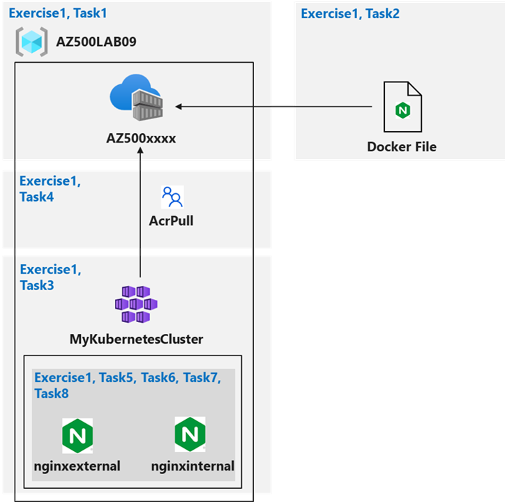

---
lab:
  title: 04 – Konfigurieren und Schützen von ACR und AKS
  module: 'Module 01 - Secure compute, storage, and databases'
---

# Lab 04: Konfigurieren und Schützen von ACR und AKS
# Lab-Handbuch für Kursteilnehmer

## Labszenario

Sie wurden gebeten, einen Proof of Concept mit Azure Container Registry und Azure Kubernetes Service bereitzustellen. Insbesondere sollte der Proof of Concept Folgendes veranschaulichen:

- Verwenden von Dockerfile zum Erstellen eines Images.
- Verwenden von Azure Container Registry zum Speichern von Images.
- Konfigurieren von Azure Kubernetes Service.
- Schützen von und Zugreifen auf Containeranwendungen sowohl intern als auch extern. 

> Für alle Ressourcen in diesem Lab verwenden wir die Region **USA, Osten**. Vergewissern Sie sich bei Ihrem Kursleiter, dass dies die Region ist, die für den Kurs verwendet werden soll. 

## Ziele des Labs

In diesem Lab führen Sie die folgende Übung aus:

- Übung 1: Konfigurieren und Schützen von ACR und AKS

## Diagramm zum Konfigurieren und Sichern von ACR und AKS



## Anweisungen

## Lab-Dateien:

- **\\Allfiles\\Labs\\09\\nginxexternal.yaml**
- **\\Allfiles\\Labs\\09\\nginxinternal.yaml**

### Übung 1: Konfigurieren und Schützen von ACR und AKS

### Geschätzte Zeit: 45 Minuten

> Für alle Ressourcen in diesem Lab verwenden wir die Region **USA, Osten**. Vergewissern Sie sich bei Ihrem Kursleiter, dass dies die Region ist, die für den Kurs verwendet werden soll. 

In dieser Übung führen Sie die folgenden Aufgaben aus:

- Aufgabe 1: Erstellen einer Azure Container Registry-Instanz
- Aufgabe 2: Erstellen einer Dockerfile, Erstellen eines Containers und Übertragen per Push in Azure Container Registry
- Aufgabe 3: Erstellen eines Azure Kubernetes Service-Clusters
- Aufgabe 4: Gewähren der AKS-Clusterberechtigungen für den Zugriff auf ACR
- Aufgabe 5: Bereitstellen eines externen Diensts in AKS
- Aufgabe 6: Überprüfen, ob Sie auf einen externen von AKS gehosteten Dienst zugreifen können
- Aufgabe 7: Bereitstellen eines internen Diensts in AKS
- Aufgabe 8: Überprüfen, ob Sie auf einen internen von AKS gehosteten Dienst zugreifen können

#### Aufgabe 1: Erstellen einer Azure Container Registry-Instanz

In dieser Aufgabe erstellen Sie eine Ressourcengruppe für das Lab und eine Azure Container Registry-Instanz.

1. Melden Sie sich beim Azure-Portal ( **`https://portal.azure.com/`** ) an.

    >**Hinweis**: Melden Sie sich beim Azure-Portal mit einem Konto an, das in dem Azure-Abonnement, das Sie für dieses Lab verwenden, über die Rolle „Besitzer“ oder „Mitwirkender“ und die Rolle „Globaler Administrator“ im Microsoft Entra-Mandanten verfügt, der diesem Abonnement zugeordnet ist.

2. Öffnen Sie im Azure-Portal den Cloud Shell-Bereich, indem Sie oben rechts im Azure-Portal auf das erste Symbol klicken. Wenn Sie dazu aufgefordert werden, klicken Sie auf **Bash** und dann auf **Speicher erstellen**.

3. Stellen Sie sicher, dass oben links im Cloud Shell-Bereich im Dropdownmenü der Eintrag **Bash** ausgewählt ist.

4. Führen Sie in der Bash-Sitzung im Cloud Shell-Bereich den folgenden Code aus, um eine neue Ressourcengruppe für dieses Lab zu erstellen:

    ```sh
    az group create --name AZ500LAB09 --location eastus
    ```

5. Führen Sie in der Bash-Sitzung im Cloud Shell-Bereich den folgenden Code aus, um zu überprüfen, ob die Ressourcengruppe erstellt wurde:

    ```
    az group list --query "[?name=='AZ500LAB09']" -o table
    ```

6. Führen Sie in der Bash-Sitzung im Cloud Shell-Bereich den folgenden Code aus, um eine neue ACR-Instanz (Azure Container Registry) zu erstellen (der Name der ACR-Instanz muss global eindeutig sein): 

    ```sh
    az acr create --resource-group AZ500LAB09 --name az500$RANDOM$RANDOM --sku Basic
    ```
    > **Hinweis** Registrieren Sie den Azure Container Registry-Ressourcenanbieter. Wenn beim Ausführen von `az acr create` ein Fehler auftritt, liegt dies wahrscheinlich daran, dass der Dienst **Azure Container Registry** noch nicht für Ihr Abonnement registriert wurde. Um dies zu beheben, können Sie den Dienst registrieren und Ihre Registrierung mit einem einzigen Befehl erstellen:
    
    > ```sh
    > az provider register --namespace Microsoft.ContainerRegistry
    > ```

7. Führen Sie in der Bash-Sitzung im Cloud Shell-Bereich den folgenden Code aus, um zu überprüfen, ob die neue ACR-Instanz erstellt wurde:

    ```sh
    az acr list --resource-group AZ500LAB09
    ```

    >**Hinweis**: Notieren Sie den Namen der ACR-Instanz. Sie werden dies in der nächsten Aufgabe benötigen.

#### Aufgabe 2: Erstellen einer Dockerfile, Erstellen eines Containers und Übertragen per Push in Azure Container Registry

In dieser Aufgabe erstellen Sie eine Dockerfile, erstellen ein Image aus der Dockerfile und stellen das Image in der ACR-Instanz bereit. 

1. Führen Sie in der Bash-Sitzung im Cloud Shell-Bereich den folgenden Code aus, um eine Dockerfile zum Erstellen eines Nginx-basierten Images zu erstellen: 

    ```sh
    echo FROM nginx > Dockerfile
    ```

2. Führen Sie in der Bash-Sitzung im Cloud Shell-Bereich den folgenden Code aus, um ein Image aus der Dockerfile zu erstellen und das Image per Push an die neue ACR-Instanz zu übertragen. 

    >**Hinweis**: Der nachstehende Punkt am Ende des Befehls ist erforderlich. Er legt das aktuelle Verzeichnis wird als Speicherort der Dockerfile fest. 

    ```sh
    ACRNAME=$(az acr list --resource-group AZ500LAB09 --query '[].{Name:name}' --output tsv)

    az acr build --resource-group AZ500LAB09 --image sample/nginx:v1 --registry $ACRNAME --file Dockerfile .
    ```

    >**Hinweis**: Warten Sie, bis der Befehl erfolgreich abgeschlossen wurde. Dies kann etwa zwei Minuten dauern.

3. Schließen Sie den Cloud Shell-Bereich.

4. Navigieren Sie im Azure-Portal zur Ressourcengruppe **AZ500Lab09**, und klicken Sie in der Liste der Ressourcen auf den Eintrag, der die Azure Container Registry-Instanz darstellt, die Sie in der vorherigen Aufgabe bereitgestellt haben.

5. Klicken Sie auf dem Blatt „Containerregistrierung“ im Abschnitt **Dienste** auf **Repositorys**. 

6. Vergewissern Sie sich, dass die Liste der Repositorys das neue Containerimage mit dem Namen **sample/nginx** enthält.

7. Klicken Sie auf den Eintrag **sample/nginx**. und überprüfen Sie, ob das Tag **v1** vorhanden ist, das die Imageversion identifiziert.

8. Klicken Sie auf den Eintrag **v1**. um das Imagemanifest anzuzeigen.

    >**Hinweis**: Das Manifest enthält den Sha256-Digest, das Erstellungsdatum des Manifests sowie Plattformeinträge. 

#### Aufgabe 3: Erstellen eines Azure Kubernetes Service-Clusters

In dieser Aufgabe erstellen Sie einen Azure Kubernetes-Dienst und überprüfen die bereitgestellten Ressourcen. 

1. Geben Sie im Azure-Portal oben auf der Azure-Portalseite im Textfeld **Nach Ressourcen, Diensten und Dokumenten suchen** den Begriff **Kubernetes-Dienste** ein, und drücken Sie die **EINGABETASTE**.

2. Klicken Sie auf dem Blatt **Kubernetes-Dienste** auf **+ Erstellen,** und dann im Dropdownmenü auf **+ Create a Kubernetes cluster** (+ Kubernetes-Cluster hinzufügen).

3. Wählen Sie auf der Registerkarte **Grundlagen** auf dem Blatt **Kubernetes-Cluster erstellen** die Option **Vordefinierte Konfiguration des Clusters** und dann **Dev/Test ($)** aus. Geben Sie nun die folgenden Einstellungen an (übernehmen Sie für andere die Standardwerte):

    |Einstellung|Wert|
    |----|----|
    |Subscription|Der Name des Azure-Abonnements, das Sie in diesem Lab verwenden.|
    |Resource group|**AZ500LAB09**|
    |Kubernetes-Clustername|**MyKubernetesCluster**|
    |Region|**(USA) USA, Osten**|
    |Verfügbarkeitszonen |**None**|
    |Skalierungsmethode|**Manuell**|
    |Anzahl der Knoten|**1**|

4. Klicken Sie auf **Weiter: Knotenpools >** , und geben Sie auf dem Blatt **Kubernetes-Cluster erstellen** auf der Registerkarte **Knotenpools** die folgenden Einstellungen an (und übernehmen Sie die Standardwerte für die übrigen Einstellungen):

    |Einstellung|Wert|
    |----|----|
    |Aktivieren von virtuellen Knoten|Kontrollkästchen deaktiviert|
    
5. Klicken Sie auf **Next: Zugriff >** , übernehmen Sie auf der Registerkarte **Zugriff** auf dem Blatt **Kubernetes-Cluster erstellen** die Standardwerte, und klicken Sie auf **Weiter: Netzwerk >** aus. 

6. Geben Sie auf der Registerkarte **Netzwerk** des Blatts **Kubernetes-Cluster erstellen** die folgenden Einstellungen an (und übernehmen Sie die Standardwerte für die übrigen Einstellungen):

    |Einstellung|Wert|
    |----|----|
    |Netzwerkkonfiguration|**Azure CNI Overlay**|
    |DNS-Namenspräfix|**Behalten Sie den Standardwert bei.**|

    >**Hinweis**: AKS kann als privater Cluster konfiguriert werden. Dadurch wird dem API-Server eine private IP-Adresse zugewiesen, um sicherzustellen, dass der Netzwerkdatenverkehr zwischen Ihrem API-Server und den Knotenpools ausschließlich im privaten Netzwerk verbleibt. Weitere Informationen finden Sie auf der Seite [Erstellen eines privaten Azure Kubernetes Service-Clusters](https://docs.microsoft.com/en-us/azure/aks/private-clusters).

7. Klicken Sie auf **Weiter: Integrationen >** , und legen Sie auf dem Blatt **Kubernetes-Cluster erstellen** auf der Registerkarte **Integrationen** die **Containerüberwachung** auf **Deaktiviert** fest. 

    >**Hinweis**: In Produktionsszenarien sollten Sie die Überwachung aktivieren. In diesem Fall ist die Überwachung deaktiviert, weil sie im Lab nicht behandelt wird. 

8. Klicken Sie auf **Überprüfen + erstellen** und dann auf **Erstellen**.

    >**Hinweis**: Warten Sie, bis die Bereitstellung abgeschlossen ist. Dies kann etwa zehn Minuten dauern.

9. Sobald die Bereitstellung abgeschlossen ist, geben Sie im Azure-Portal oben auf der Azure-Portalseite im Textfeld **Nach Ressourcen, Diensten und Dokumenten suchen** den Begriff **Ressourcengruppen** ein, und drücken Sie die **EINGABETASTE**.

10. Beachten Sie auf dem Blatt **Ressourcengruppen** in der Auflistung der Ressourcengruppen eine neue Ressourcengruppe namens **MC_AZ500LAB09_MyKubernetesCluster_eastus**, die Komponenten der AKS-Knoten enthält. Überprüfen Sie die Ressourcen in dieser Ressourcengruppe. 
    
11. Navigieren Sie zurück zum Blatt **Ressourcengruppen**, und klicken Sie auf den Eintrag **AZ500LAB09**. 

    >**Hinweis**: Notieren Sie sich in der Liste der Ressourcen den AKS-Cluster und das entsprechende virtuelle Netzwerk.

12. Öffnen Sie im Azure-Portal eine Bash-Sitzung im Cloud Shell-Bereich. 

    >**Hinweis**: Stellen Sie sicher, dass oben links im Cloud Shell-Bereich im Dropdownmenü der Eintrag **Bash** ausgewählt ist.

13. Führen Sie in der Bash-Sitzung im Cloud Shell-Bereich den folgenden Code aus, um eine Verbindung mit dem Kubernetes-Cluster herzustellen:

    ```sh
    az aks get-credentials --resource-group AZ500LAB09 --name MyKubernetesCluster
    ```

14. Führen Sie in der Bash-Sitzung im Cloud Shell-Bereich den folgenden Code aus, um eine Verbindung mit dem Kubernetes-Cluster herzustellen: 

    ```sh
    kubectl get nodes
    ```

    >**Hinweis**: Überprüfen Sie, ob der **Status** des Clusterknotens als **Ready** (Bereit) aufgeführt ist.

#### Aufgabe 4: Gewähren der AKS-Clusterberechtigungen für den Zugriff auf ACR und die Verwaltung des virtuellen Netzwerks

In dieser Aufgabe erteilen Sie die AKS-Clusterberechtigung für den Zugriff auf ACR und die Verwaltung des virtuellen Netzwerks. 

1. Führen Sie in der Bash-Sitzung im Cloud Shell-Bereich den folgenden Code aus, um den AKS-Cluster für die Verwendung der Azure Container Registry-Instanz zu konfigurieren, die Sie zuvor in diesem Lab erstellt haben. 

    ```sh
    ACRNAME=$(az acr list --resource-group AZ500LAB09 --query '[].{Name:name}' --output tsv)

    az aks update -n MyKubernetesCluster -g AZ500LAB09 --attach-acr $ACRNAME
    ```

    >**Hinweis**: Dieser Befehl gewährt der ACR-Instanz die Rollenzuweisung „acrpull“. 

    >**Hinweis**: Es kann einige Minuten dauern, bis dieser Befehl abgeschlossen ist. 

2. Führen Sie in der Bash-Sitzung im Cloud Shell-Bereich den folgenden Code aus, um dem AKS-Cluster die Rolle „Mitwirkender“ für sein virtuelles Netzwerk zu gewähren. 

    ```sh
    RG_AKS=AZ500LAB09

    RG_VNET=MC_AZ500LAB09_MyKubernetesCluster_eastus    

    AKS_VNET_NAME=aks-vnet-30198516
    
    AKS_CLUSTER_NAME=MyKubernetesCluster
    
    AKS_VNET_ID=$(az network vnet show --name $AKS_VNET_NAME --resource-group $RG_VNET --query id -o tsv)
    
    AKS_MANAGED_ID=$(az aks show --name $AKS_CLUSTER_NAME --resource-group $RG_AKS --query identity.principalId -o tsv)
    
    az role assignment create --assignee $AKS_MANAGED_ID --role "Contributor" --scope $AKS_VNET_ID
    ```

#### Aufgabe 5: Bereitstellen eines externen Diensts in AKS

In dieser Aufgabe laden Sie die Manifestdateien herunter, bearbeiten die YAML-Datei und wenden Ihre Änderungen auf den Cluster an. 

1. Klicken Sie in der Bash-Sitzung im Cloud Shell-Bereich auf das Symbol für **Hochladen/Dateien herunterladen**. Klicken Sie im Dropdownmenü auf **Hochladen**. Navigieren Sie im Dialogfeld **Öffnen** zu dem Speicherort, an den Sie die Labdateien heruntergeladen haben, wählen Sie **\\Allfiles\\Labs\\09\\nginxexternal.yaml** aus, und klicken Sie auf **Öffnen**. Wählen Sie als Nächstes **\\Allfiles\\Labs\\09\\nginxinternal.yaml** aus, und klicken Sie auf **Öffnen**.

2. Führen Sie in der Bash-Sitzung im Cloud Shell-Bereich den folgenden Code aus, um den Namen der Azure Container Registry-Instanz zu identifizieren:

    ```sh
    echo $ACRNAME
    ```

    >**Hinweis**: Notieren Sie sich den Namen der Azure Container Registry-Instanz. Sie benötigen ihn später in dieser Aufgabe.

3. Führen Sie in der Bash-Sitzung im Cloud Shell-Bereich den folgenden Code aus, um die Datei „nginxexternal.yaml“ zu öffnen und deren Inhalt zu bearbeiten. 

    ```sh
    code ./nginxexternal.yaml
    ```

    >**Hinweis**: Dies ist die *externe* YAML-Datei.

4. Scrollen Sie im Editor-Bereich nach unten zu **Zeile 24**, und ersetzen Sie den Platzhalter **`<ACRUniquename>`** durch den ACR-Namen.

5. Klicken Sie im Editor-Bereich in der oberen rechten Ecke auf das Symbol mit den **Auslassungszeichen**, anschließend auf **Speichern** und dann auf **Editor schließen**. 

6. Führen Sie in der Bash-Sitzung im Cloud Shell-Bereich den folgenden Code aus, um die Änderung auf den Cluster anzuwenden:

    ```sh
    kubectl apply -f nginxexternal.yaml
    ```

7. Überprüfen Sie in der Bash-Sitzung im Cloud Shell-Bereich die Ausgabe des Befehls, den Sie in der vorherigen Aufgabe ausgeführt haben, um sicherzustellen, dass die Bereitstellung und der entsprechende Dienst erstellt wurden. 

    ```
    deployment.apps/nginxexternal created
    service/nginxexternal created
    ```

#### Aufgabe 6: Überprüfen, ob Sie auf einen externen von AKS gehosteten Dienst zugreifen können

Stellen Sie in dieser Aufgabe sicher, dass mithilfe der öffentlichen IP-Adresse extern auf den Container zugegriffen werden kann.

1. Führen Sie in der Bash-Sitzung im Cloud Shell-Bereich den folgenden Code aus, um Informationen zum nginxexternal-Dienst abzurufen, beispielsweise Namen, Typ, IP-Adressen und Ports. 

    ```sh
    kubectl get service nginxexternal
    ```

2. Überprüfen in der Bash-Sitzung im Cloud Shell-Bereich die Ausgabe, und notieren Sie den Wert in der Spalte „External-IP“. Sie benötigen diese Angaben im nächsten Schritt. 

3. Öffnen Sie eine neue Browserregisterkarte, und gehen Sie zur IP-Adresse, die Sie im vorherigen Schritt ermittelt haben.

4. Stellen Si sicher, dass die Seite **Willkommen bei nginx!** angezeigt wird. 

#### Aufgabe 7: Bereitstellen eines internen Diensts in AKS

In dieser Aufgabe stellen Sie den internen Dienst in AKS bereit. 

1. Führen Sie in der Bash-Sitzung im Cloud Shell-Bereich den folgenden Code aus, um die Datei „nginxinternal.yaml“ zu öffnen und deren Inhalt zu bearbeiten. 

    ```sh
    code ./nginxinternal.yaml
    ```

    >**Hinweis**: Dies ist die *interne* YAML-Datei.

2. Scrollen Sie im Editor-Bereich nach unten zu der Zeile, die den Verweis auf das Containerimage enthält, und ersetzen Sie den Platzhalter **`<ACRUniquename>`** durch den ACR-Namen.

3. Klicken Sie im Editor-Bereich in der oberen rechten Ecke auf das Symbol mit den **Auslassungszeichen**, anschließend auf **Speichern** und dann auf **Editor schließen**. 

4. Führen Sie in der Bash-Sitzung im Cloud Shell-Bereich den folgenden Code aus, um die Änderung auf den Cluster anzuwenden:

    ```sh
    kubectl apply -f nginxinternal.yaml
    ```

5.  Überprüfen Sie in der Bash-Sitzung im Cloud Shell-Bereich die Ausgabe, um sicherzustellen, dass Ihre Bereitstellung und der Dienst erstellt wurden:

    ```
    deployment.apps/nginxinternal created
    service/nginxinternal created
    ```

6. Führen Sie in der Bash-Sitzung im Cloud Shell-Bereich den folgenden Code aus, um Informationen zum nginxinternal-Dienst abzurufen, beispielsweise Namen, Typ, IP-Adressen und Ports. 

    ```sh
    kubectl get service nginxinternal
    ```

7. Überprüfen Sie in der Bash-Sitzung im Cloud Shell-Bereich die Ausgabe. „External-IP“ ist in diesem Fall eine private IP-Adresse. Wenn der Status **Ausstehend** angezeigt wird, führen Sie den vorherigen Befehl erneut aus.

    >**Hinweis**: Notieren Sie sich diese IP-Adresse. Sie werden dies in der nächsten Aufgabe benötigen. 

    >**Hinweis**: Für den Zugriff auf den internen Dienstendpunkt stellen Sie interaktiv eine Verbindung mit einem der im Cluster ausgeführten Pods her. 

    >**Hinweis**: Alternativ können Sie die CLUSTER-IP-Adresse verwenden.

#### Aufgabe 8: Überprüfen, ob Sie auf einen internen von AKS gehosteten Dienst zugreifen können

In dieser Aufgabe verwenden Sie einen der Pods, die im AKS-Cluster ausgeführt werden, um auf den internen Dienst zuzugreifen. 

1. Führen Sie in der Bash-Sitzung im Cloud Shell-Bereich den folgenden Code aus, um die Pods im Standardnamespace im AKS-Cluster aufzulisten:

    ```sh
    kubectl get pods
    ```

2. Kopieren Sie in der Liste der Pods den ersten Eintrag in der Spalte **NAME**.

    >**Hinweis**: Dies ist der Pod, den Sie in den nachfolgenden Schritten verwenden.

3. Führen Sie in der Bash-Sitzung im Cloud Shell-Bereich den folgenden Code aus, um interaktiv eine Verbindung mit dem ersten Pod herzustellen (ersetzen Sie den Platzhalter `<pod_name>` durch den Namen, den Sie im vorherigen Schritt kopiert haben):

    ```sh
    kubectl exec -it <pod_name> -- /bin/bash
    ```

4. Führen Sie in der Bash-Sitzung im Cloud Shell-Bereich den folgenden Code aus, um zu überprüfen, ob die nginx-Website über die private IP-Adresse des Diensts verfügbar ist (ersetzen Sie den Platzhalter `<internal_IP>` durch die IP-Adresse, die Sie in der vorherigen Aufgabe notiert haben):

    ```sh
    curl http://<internal_IP>
    ```

5. Schließen Sie den Cloud Shell-Bereich.

> Ergebnis: Sie haben ACR und AKS konfiguriert und gesichert.


**Bereinigen von Ressourcen**

> Denken Sie daran, alle neu erstellten Azure-Ressourcen zu entfernen, die Sie nicht mehr verwenden. Durch das Entfernen nicht verwendeter Ressourcen wird sichergestellt, dass keine unerwarteten Kosten anfallen.

1. Öffnen Sie im Azure-Portal den Cloud Shell-Bereich, indem Sie oben rechts im Azure-Portal auf das erste Symbol klicken. 

2. Wählen Sie im Dropdownmenü oben links im Cloud Shell-Bereich die Option **PowerShell** aus, und klicken Sie auf **Bestätigen**, wenn Sie dazu aufgefordert werden.

3. Führen Sie im Cloud Shell-Bereich in der PowerShell-Sitzung den folgenden Code aus, um die Ressourcengruppen zu entfernen, die Sie in diesem Lab erstellt haben:
  
    ```powershell
    Remove-AzResourceGroup -Name "AZ500LAB09" -Force -AsJob
    ```

4.  Schließen Sie den **Cloud Shell**-Bereich. 
