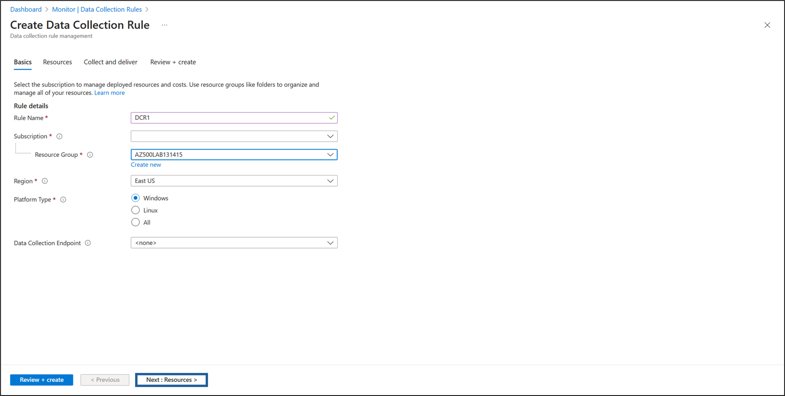
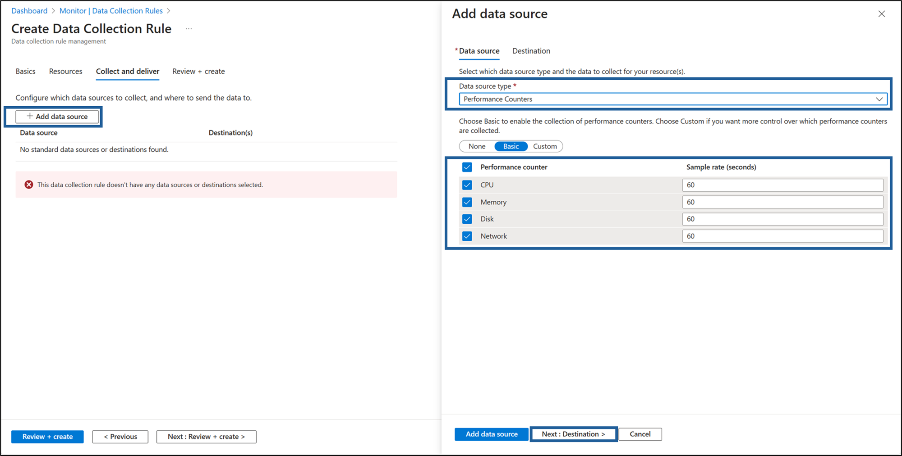

---
lab:
  title: '08 – Erstellen eines Log Analytics-Arbeitsbereichs, eines Azure Speicherkontos und einer Datensammlungsregel (Data Collection Rule, DCR)'
  module: Module 03 - Configure and manage threat protection by using Microsoft Defender for Cloud
---

# Lab 08: Erstellen eines Log Analytics-Arbeitsbereichs, eines Azure Speicherkontos und einer Datensammlungsregel (Data Collection Rule, DCR)

# Lab-Handbuch für Kursteilnehmende

## Labszenario

Als Azure-Sicherheitsingenieur für ein Finanztechnologieunternehmen sind Sie dafür zuständig, die Überwachung und Sicherheitstransparenz auf allen Azure Virtual Machines (VMs) zu verbessern, die für die Verarbeitung von Finanztransaktionen und die Verwaltung sensibler Kundendaten verwendet werden. Das Sicherheitsteam benötigt detaillierte Protokolle und Leistungskennzahlen von diesen VMs, um potenzielle Bedrohungen zu erkennen und die Systemleistung zu optimieren. Der Chief Information Security Officer (CISO) hat Sie gebeten, eine Lösung zu implementieren, die Sicherheitsereignisse, Systemprotokolle und Leistungsindikatoren erfasst. Sie wurden beauftragt, den Azure Monitor-Agent (AMA) zusammen mit den Regeln für die Datensammlung (Data Collection Rules, DCRs) zu konfigurieren, um die Protokollsammlung und Leistungsüberwachung zu zentralisieren.


> Für alle Ressourcen in diesem Lab verwenden wir die Region **USA, Osten**. Vergewissern Sie sich bei Ihrem Kursleiter, dass dies die Region ist, die für den Kurs verwendet werden soll. 

## Ziele des Labs

In diesem Lab führen Sie die folgenden Übungen aus:

- Übung 1: Bereitstellen einer Azure-VM
- Übung 2: Erstellen eines Log Analytics-Arbeitsbereichs
- Übung 3: Erstellen eines Azure-Speicherkontos
- Übung 4: Erstellen einer Datensammlungsregel
  
## Anweisungen

### Übung 1: Bereitstellen einer Azure-VM

### Übungszeitrahmen: 10 Minuten

In dieser Übung führen Sie die folgenden Aufgaben aus: 

#### Aufgabe 1: Bereitstellen eines virtuellen Azure-Computers

1. Melden Sie sich am Azure-Portal ( **`https://portal.azure.com/`** ) an.

    >**Hinweis**: Melden Sie sich am Azure-Portal mit einem Konto an, das über die Rolle „Besitzer“ oder „Mitwirkender“ in dem Azure-Abonnement verfügt, das Sie für dieses Lab nutzen.

2. Öffnen Sie die Cloud Shell, indem Sie oben rechts im Azure-Portal auf das erste Symbol klicken. Wenn Sie dazu aufgefordert werden, wählen Sie **PowerShell** aus.

3. Stellen Sie sicher, dass oben links im Bereich „Cloud Shell“ im Dropdownmenü der Eintrag **PowerShell** ausgewählt ist.

4. Lassen Sie im Fenster **Erste Schritte** die Standardeinstellung unverändert: **Wählen Sie ein Abonnement aus, um zu beginnen. Optional können Sie ein Speicherkonto einbinden, um Dateien zwischen Sitzungen beizubehalten. Kein Speicherkonto erforderlich.**

5. Wählen Sie aus dem Dropdown-Menü **Abonnement** Ihr **Abonnement aus.**

6. Lassen Sie **Ein vorhandenes privates virtuelles Netzwerk verwenden** deaktiviert und klicken Sie dann auf **Anwenden.**

7. Führen Sie in der PowerShell-Sitzung im Bereich „Cloud Shell“ den folgenden Code zum Erstellen einer Ressourcengruppe aus, die Sie in diesem Lab verwenden:
  
    ```powershell
    New-AzResourceGroup -Name AZ500LAB131415 -Location 'EastUS'
    ```

    >**Hinweis:** Diese Ressourcengruppe wird für die Labs 8, 9 und 10 verwendet.

8. Führen Sie in der PowerShell-Sitzung im Cloud Shell-Bereich Folgendes aus, um die Verschlüsselung auf dem Host (EAH) zu aktivieren.
   
   ```powershell
    Register-AzProviderFeature -FeatureName "EncryptionAtHost" -ProviderNamespace Microsoft.Compute 
    ```

5. Führen Sie in der PowerShell-Sitzung im Bereich „Cloud Shell“ Folgendes aus, um einen neuen virtuellen Azure-Computer zu erstellen: 

    ```powershell
    New-AzVm -ResourceGroupName "AZ500LAB131415" -Name "myVM" -Location 'EastUS' -VirtualNetworkName "myVnet" -SubnetName "mySubnet" -SecurityGroupName   "myNetworkSecurityGroup" -PublicIpAddressName "myPublicIpAddress" -PublicIpSku Standard -OpenPorts 80,3389 -Size Standard_D2_v4 
    ```
    
6.  Wenn Sie zur Eingabe von Anmeldeinformationen aufgefordert werden:

    |Einstellung|Wert|
    |---|---|
    |Benutzer |**localadmin**|
    |Kennwort|**Verwenden Sie Ihr persönliches Kennwort, das Sie in Lab 02 > Übung 2 > Aufgabe 1 > Schritt 3 erstellt haben.**|

    >**Hinweis**: Warten Sie, bis die Bereitstellung abgeschlossen ist. 

7. Führen Sie in der PowerShell-Sitzung im Bereich „Cloud Shell“ Folgendes aus, um zu bestätigen, dass der virtuelle Computer **myVM** erstellt wurde und sein Status **provisioningState** **Erfolgreich** lautet:

    ```powershell
    Get-AzVM -Name 'myVM' -ResourceGroupName 'AZ500LAB131415' | Format-Table
    ```

8. Schließen Sie den Cloud Shell-Bereich. 

### Übung 2: Erstellen eines Log Analytics-Arbeitsbereichs

### Übungszeitrahmen: 10 Minuten

In dieser Übung führen Sie die folgenden Aufgaben aus: 

#### Aufgabe 1: Erstellen eines Log Analytics-Arbeitsbereichs

In dieser Aufgabe erstellen Sie einen Log Analytics-Arbeitsbereich. 

1. Geben Sie im Azure-Portal oben auf der Azure-Portalseite im Textfeld **Nach Ressourcen, Diensten und Dokumenten suchen** den Begriff **Log Analytics-Arbeitsbereiche** ein, und drücken Sie die **EINGABETASTE**.

2. Klicken Sie auf dem Blatt **Log Analytics-Arbeitsbereiche** auf  **+ Erstellen**.

3. Geben Sie auf der Registerkarte **Grundeinstellungen** des Blatts **Log Analytics-Arbeitsbereiche erstellen** die folgenden Einstellungen an (übernehmen Sie für andere Einstellungen die Standardwerte):

    |Einstellung|Wert|
    |---|---|
    |Subscription|Der Name des Azure-Abonnements, das Sie in diesem Lab verwenden.|
    |Resource group|**AZ500LAB131415**|
    |Name|**lgawIgnite**|
    |Region|**USA, Osten**|

4. Klicken Sie auf **Überprüfen + erstellen**.

5. Wählen Sie auf dem Blatt **Log Analytics-Arbeitsbereich erstellen** auf der Registerkarte **Überprüfen + erstellen** die Option **Erstellen** aus.

### Übung 3: Erstellen eines Azure-Speicherkontos

### Geschätzte Zeit: 10 Minuten

In dieser Übung führen Sie die folgenden Aufgaben aus:

#### Aufgabe 1: Erstellen eines Azure-Speicherkontos

In dieser Aufgabe erstellen Sie ein Speicherkonto.

1. Geben Sie im Azure-Portal oben auf der Azure-Portalseite im Textfeld **Nach Ressourcen, Diensten und Dokumenten suchen** den Begriff **Speicherkonten** ein, und drücken Sie die **EINGABETASTE**.

2. Klicken Sie auf dem Blatt **Speicherkonten** im Azure-Portal auf die Schaltfläche **+ Erstellen**, um ein neues Speicherkonto zu erstellen.

3. Geben Sie auf der Registerkarte **Grundeinstellungen** des Blatts **Speicherkonto erstellen** die folgenden Einstellungen an (übernehmen Sie die Standardwerte für andere Einstellungen):

    |Einstellung|Wert|
    |---|---|
    |Subscription|Der Name des Azure-Abonnements, das Sie in diesem Lab verwenden.|
    |Resource group|**AZ500LAB131415**|
    **Instanzdetails** |Speicherkontoname|**strgactignite**|
    |Region|**(US) EastUS**|
    |Primärer Dienst|**Azure Blob Storage oder Azure Data Lake Storage Gen 2**|
    |Leistung|**Standard (allgemeines v2-Konto)**|
    |Redundanz|**Lokal redundanter Speicher (LRS)**|

5. Klicken Sie auf der Registerkarte **Grundlagen** der **Speicherkonto erstellen** Klinge auf **Prüfen + Erstellen.** Klicken Sie nach Abschluss des Validierungsprozesses auf **Erstellen.**.

    >**Hinweis**: Warten Sie, bis das Speicherkonto erstellt wurde. Dieser Vorgang dauert etwa zwei Minuten.

### Übung 4: Erstellen einer Datensammlungsregel

### Geschätzte Zeit: 15 Minuten

In dieser Übung führen Sie die folgenden Aufgaben aus:

#### Aufgabe 1: Erstellen einer Datensammlungsregel

In dieser Aufgabe erstellen Sie eine Datensammlungsregel.

1. Geben Sie im Azure-Portal oben auf der Azure-Portalseite im Textfeld **Nach Ressourcen, Diensten und Dokumenten suchen** den Begriff **Überwachen** ein und drücken Sie die **EINGABETASTE**.

2. Klicken Sie auf dem Blatt **Überwachungseinstellungen** auf  **Datensammlungsregeln**.

3. Klicken Sie auf die Schaltfläche **+ Erstellen**, um eine neue Regel für die Datensammlung zu erstellen.

4. Geben Sie die folgenden Einstellungen auf der Registerkarte **Grundeinstellungen** des Blatts **Datensammlung erstellen** an:
  
    |Einstellung|Wert|
    |---|---|
    **Regeldetails** |Regelname|**DCR1**|
    |Abonnement| der Name des Azure-Abonnements, das Sie in diesem Lab verwenden| |Ressourcengruppe|**AZ500LAB131415**|
    |Region|**USA, Osten**|
    |Plattformtyp| **Windows**|
    |Datensammlungsendpunkt| *Leer lassen*|

    


5. Klicken Sie auf die Schaltfläche mit dem Text **Weiter: Ressourcen >** , um fortzufahren.
   
6. Wählen Sie auf der Seite **Ressourcen** die Option **+ Ressourcen hinzufügen** aus.

7. Aktivieren Sie in der Vorlage **Bereich auswählen** das Kontrollkästchen **Abonnement** im Bereich **Umfang**.

8. Klicken Sie unten in der Vorlage **Wählen Sie einen Bereich aus** auf **Anwenden**.

9. Wählen Sie unten auf der Seite **Ressourcen** die Option **Weiter: Sammeln und liefern >** aus.

10. Klicken Sie auf **+ Datenquelle hinzufügen** und ändern Sie dann auf der Seite **Datenquelle hinzufügen** das Dropdownmenü **Datenquellentyp** auf **Leistungsindikatoren**. Behalten Sie die folgenden Standardeinstellungen bei:

    |Einstellung|Wert|
    |---|---|
    |**Leistungsindikator**|**Abtastrate (Sekunden)**|
    |CPU|60|
    |Arbeitsspeicher|60|
    |Datenträger|60|
    |Network|60|

   

11. Klicken Sie auf die Schaltfläche mit dem Text **Weiter: Ziel >** , um fortzufahren.
  
12. Klicken Sie auf **+ Ziel hinzufügen** und ändern Sie das Dropdown-Menü **Zieltyp**, um **Azure Monitor-Protokolle anzuzeigen.** Stellen Sie im Fenster **Abonnement** sicher, dass Ihr *Abonnement* angezeigt wird, und ändern Sie dann das Dropdownmenü **Konto oder Namespace** auf Ihren zuvor erstellten Log Analytics-Arbeitsbereich.

13. Wählen Sie unten auf der Seite **Datenquelle hinzufügen** aus.
    
    

14. Klicken Sie auf **Überprüfen + erstellen**.

    

15. Klicken Sie auf **Erstellen**.

> Ergebnisse: Sie haben eine Azure-VM, einen Log Analytics-Arbeitsbereich, ein Azure-Speicherkonto und eine Datensammlungsregel bereitgestellt, um mit dem Azure Monitor-Agent Ereignisse und Leistungsindikatoren von VMs zu sammeln.

>**Hinweis**: Entfernen Sie die Ressourcen nicht aus diesem Lab, da sie für das Microsoft Defender for Cloud Lab, das Lab „Just-in-Time-Zugriff auf VMs aktivieren“ und das Microsoft Sentinel Lab benötigt werden.
 
