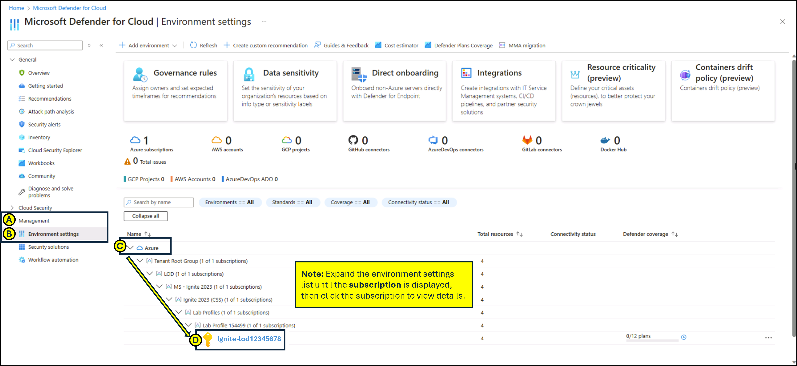

---
lab:
  title: '09: Konfigurieren von Microsoft Defender für Cloud Enhanced Security Features für Server'
  module: Module 03 - Configure and manage threat protection by using Microsoft Defender for Cloud
---

# Lab 09: Konfigurieren von Microsoft Defender für Cloud Enhanced Security Features für Server

# Lab-Handbuch für Kursteilnehmende

## Labszenario

Als Azure-Technische Fachkraft für Sicherheit für ein globales E-Commerce-Unternehmen sind Sie für die Sicherung der Cloud-Infrastruktur des Unternehmens verantwortlich. Die Organisation verlässt sich bei der Ausführung kritischer Anwendungen, der Verwaltung von Kundendaten und der Verarbeitung von Transaktionen stark auf Azure Virtual Machines (VMs) und lokale Server. Der Chief Information Security Officer (CISO) hat festgestellt, dass verbesserte Sicherheitsmaßnahmen erforderlich sind, um diese Ressourcen vor Cyberbedrohungen, Schwachstellen und Fehlkonfigurationen zu schützen. Sie wurden beauftragt, Microsoft Defender for Servers in Microsoft Defender for Cloud zu aktivieren, um erweiterten Schutz vor Bedrohungen und Sicherheitsüberwachung für Azure-VMs und Hybridserver bereitzustellen.

## Ziele des Labs

- Konfigurieren von Features von Microsoft Defender for Cloud für erhöhte Sicherheit für Server
  
- Überprüfen der erweiterten Sicherheitsfeatures für Microsoft Defender for Server Plan 2

## Übungsanweisungen

### Konfigurieren von Features von Microsoft Defender for Cloud für erhöhte Sicherheit für Server

1. Geben Sie im Azure-Portal in das Textfeld „Ressourcen, Dienste und Dokumente suchen“ oben auf der Azure-Portalseite **Microsoft Defender for Cloud** ein und drücken Sie dann die **Eingabetaste**.

2. Gehen Sie auf **Microsoft Defender for Cloud**, **Verwaltungsblatt**, zu den **Umgebungseinstellungen**. Erweitern Sie die Ordner für die Umgebungseinstellungen, bis der Abschnitt **Abonnement** angezeigt wird, und klicken Sie dann auf das **Abonnement**, um Details anzuzeigen.

   
   
3. Erweitern Sie im Blatt **Einstellungen** unter **Defender-Pläne** **Cloud Workload Protection (CWP)“**.

4. Wählen Sie in der Liste **Cloud Workload Protection (CWP)-Plan** die Option **Server** aus. Ändern Sie auf der rechten Seite den **Status** von **Aus** in **Ein**, und klicken Sie dann auf **Speichern**.

5. Um die Details von **Microsoft Defender for Servers Plan 2** zu überprüfen, wählen Sie **Plan ändern >**.

   Hinweis: Wenn Sie den Cloud Workload Protection (CWP)-Serverplan von „Aus“ auf „Ein“ setzen, wird der „Microsoft Defender for Servers Plan 2“ aktiviert.
 
   
   
> **Ergebnisse**: Sie müssen Microsoft Defender for Servers Plan 2 in Ihrem Abonnement aktivieren.
